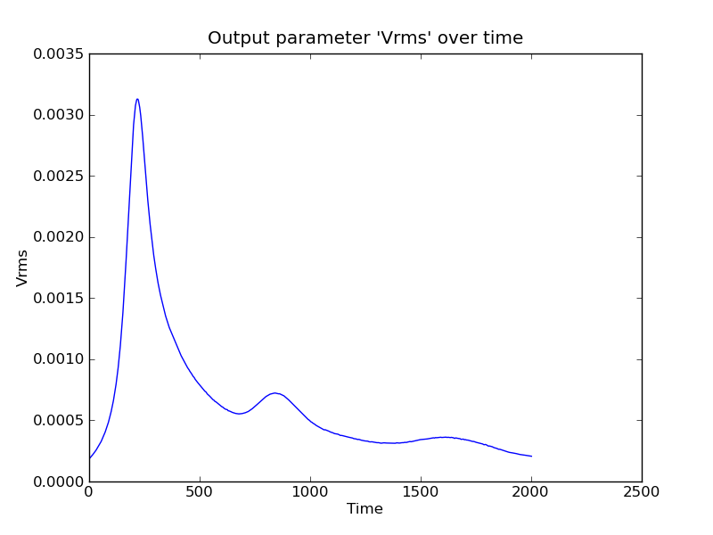

.. _credo-examples-configure-scibenchmark:

Running and configuring Scientific Benchmark Tests
^^^^^^^^^^^^^^^^^^^^^^^^^^^^^^^^^^^^^^^^^^^^^^^^^^

The Sci Benchmark testing interface for CREDO is still being developed, but
essentially requires the user to write a Python script to configure and run
a particular benchmark. This interface was chosen since benchmarks generally
require more detailed specification and configuration than standard system
tests.

Setup
"""""

An example science benchmark test is that a Rayleigh Taylor model can perform
as required by the Van Keken benchmark:

.. include:: ../../../Underworld/SysTest/ScienceBenchmarks/credo_rayTayBenchmark.py
   :literal:

As the code shows, once you set up a SciBenchmarkTest, you need to then add
TestComponents that check that the model to be run actually passes some
benchmark conditions. In this case, we're checking that the Vrms output into the
FrequentOutput.txt each timestep has a maximum value within a specified range,
within a specified time range.

Outputs
"""""""

Running the above script will take some time on most PCs, as we've asked for a
significant number of steps at a reasonable resolution. 

It should show something like the following at the terminal:

.. literalinclude:: RayTayBenchmark/scriptTerminalOutput.txt

and will save outputs from the run in the directory
`output/RayleighTaylor-VanKekenBenchmark/`.

These include the following XML description of the SysTest as a record of the
result:

.. literalinclude:: RayTayBenchmark/SysTest-RayleighTaylorBenchmark-sciBenchmarkTest.xml

In future we will add capability to automatically save images of important
aspects of the System test, such as a graph of VRMS against time like the one
below, and compare them to expected results:

