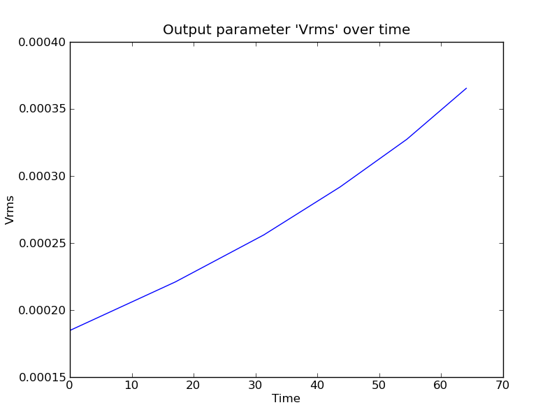

.. _credo-examples-raytay-run-basic:

Using CREDO to run and analyse a Rayleigh-Taylor problem in Underworld
----------------------------------------------------------------------

This examples shows how to use CREDO to run a simple single Underworld job, and
perform some basic post-processing on the results, such as getting relevant
values from the FrequentOutput.dat, and plotting observables of interest.

Setup
"""""

The script to run a Rayleigh Taylor model is as included below, currently in the
Underworld/InputFiles directory:

.. literalinclude:: ../../../Underworld/InputFiles/credo_rayTayBasic.py
   :linenos:

The script above the `#-----------------` comment line is setting up and running
the model, and that below it is for doing some simple post-processing and
analysis of the result.

Essentially, what we are doing is setting up a ModelRun to run the
"RayleighTaylorBenchmark.xml" model, with some small customisations to some of
the parameters. We also specify to save information about the model run via the
:meth:`~credo.modelrun.ModelRun.writeInfoXML` method and
:meth:`~credo.modelresult.writeModelResultsXML` function.

.. seealso:: Modules :mod:`credo.modelrun` and :mod:`credo.modelresult`

Looking at the post-processing in more detail:

.. literalinclude:: ../../../Underworld/InputFiles/credo_rayTayBasic.py
   :language: python
   :lines: 20-

We first use the :meth:`~credo.modelresult.ModelResult.readFrequentOutput()`
method to read the FrequentOutput.dat results into memory and make them
accessible through CREDO, bound to a `freqOutput` attribute of the mRes object.
We are then able to use various methods of this 
:class:`credo.io.stgfreq.FreqOutput` class to query the Frequent Output for
properties of interest - in this case the maximum value of the "Vrms" property,
the time this occurred. We also use the plotOverTime() method to plot and save a
graph of the value of Vrms over time in the model.

.. seealso:: The :class:`credo.io.stgfreq.FreqOutput` class, especially the
   :meth:`~credo.io.stgfreq.FreqOutput.plotOverTime` method.

Outputs
"""""""

Running this script at the terminal produces:

.. literalinclude:: RayTayBasic/scriptTerminalOutput.txt

Where the last line is the result of our post-processing query.

.. _credo-examples-raytay-run-basic-plot:

If you have Matplotlib installed, it will also produce a pop-up window showing
the graph of VRMS against time, something like that shown below:

In the script above you can see the output path requested for the model was
`./output/raytay-scibench-credo-basic`.

.. _credo-examples-raytay-run-basic-outputdir:

If you have a look at the contents of the directory, as well all of the
standard output that an Underworld run saves [#f1]_, you'll see
several things specific to CREDO:

* An `credo-analysis.xml` file, recording a summary StGermain format XML of
  over-rides or new components created to complete the required analysis
  specified in the CREDO script;
* `ModelRun-RayTay-basicBenchmark.xml` and 
  `ModelResult-RayTay-basicBenchmark.xml` files, which keep a record of what
  CREDO was asked to run and the result it produced
* `Vrms-timeSeries.png`, a saved copy of the image shown above [#f2]_.

The contents of the ModelRun and ModelResult XML files should look something
like the below:

.. literalinclude:: ./RayTayBasic/ModelRun-RayTay-basicBenchmark.xml

... and: 

.. literalinclude:: ./RayTayBasic/ModelResult-RayTay-basicBenchmark.xml

You will see that they save essential quantities about the run requested and the
result [#f3]_.  

.. rubric:: Footnotes

.. [#f1] such as FrequentOutput.dat, and a record of the flattened XML produced
   by the run as `input.xml`. For more on these, see the Underworld manual.
.. [#f2] Note it's possible not to save these images, by passing `save=False` as
   a keyword argument to the plotOverTime method 
   (see :meth:`~credo.io.stgfreq.FreqOutput.plotOverTime`).
.. [#f3] Note: in future, we plan to provide the capability to read in a
   ModelResult.xml file into CREDO, which will create a ModelResult object for 
   post-processing. However as yet this capability isn't included.
