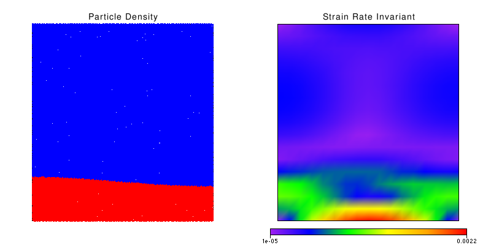
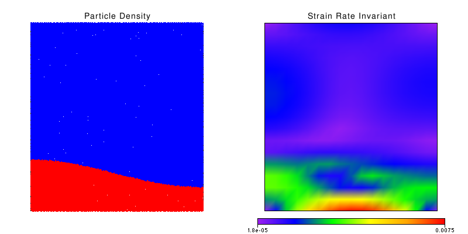

.. _credo-examples-raytay-run-suite:

Using CREDO to run and analyse a Suite of Rayleigh-Taylor problems
------------------------------------------------------------------

This examples shows how to use CREDO to run a suite of Underworld runs, based
on the same Model XML, but varying different parameters.

.. Note:: This example script is based on the same Rayleigh Taylor model
   as described in the
   :ref:`credo-examples-raytay-run-basic` section, so please read that section
   first as it goes into more detail about set-up and results.

.. Note:: This capability of the CREDO toolkit is under active development,
   so check back here regularly for new features and updates.

Setup
"""""

The script to run a suite of Rayleigh Taylor model is as included below,
currently in the Underworld/InputFiles directory:

.. literalinclude:: ../../../Underworld/InputFiles/credo_rayTaySuite.py
   :linenos:

As with the script described in the 
:ref:`Basic Ray-Tay example <credo-examples-raytay-run-basic>`, 
above the `#-----------------` comment line is setting up and running
the model, and that below it is for doing some simple post-processing and
analysis of the result.

In this case, as well as setting up a ModelRun object as we did in the basic
Ray-Tay example, we also want to create a :class:`~credo.modelsuite.ModelSuite`
where the RayTay ModelRun is used as a template (line 11). We then set up
the suite to vary the model parameters Gravity, and the amplitude of the 
Light layer shape (lines 12-17). Finally, on line 18 we request CREDO to run
the entire suite. Unlike in the 
:ref:`Basic Ray-Tay example <credo-examples-raytay-run-basic>`, we don't have
to specifically request XMLs records to be saved, the ModelSuite will do this
for us automatically.

.. seealso:: Modules :mod:`credo.modelsuite`, :mod:`credo.modelrun`, and
   :mod:`credo.modelresult`.

Looking at the post-processing in more detail:

.. literalinclude:: ../../../Underworld/InputFiles/credo_rayTaySuite.py
   :language: python
   :lines: 20-

We are using the Python `for
<http://docs.python.org/tutorial/controlflow.html#for-statements>`_ control flow
statement to loop over each ModelResult in the group of them produced by the
ModelSuite [#f1]_. We are also using the saved set of ModelRun objects in the
ModelSuite (in the `mSuite.runs` list) to look up the relevant values for
gravity and the shape's amplitude that were generated from the ranges we
specified earlier. 

Apart from this, the actual analysis done for each run is the same as in the
:ref:`Basic Ray-Tay example <credo-examples-raytay-run-basic>`.

.. seealso:: The :class:`credo.io.stgfreq.FreqOutput` class, especially the
   :meth:`~credo.io.stgfreq.FreqOutput.plotOverTime` method.

Outputs
"""""""

Since we asked for a suite of ModelRuns, we expect CREDO to run each of the
individual runs in turn. The "base" output path requested was
`output/raytay-suite`: this means that CREDO will save the results in here,
with individual ModelRuns saved in sub-directories with names based on
the parameters involved.

Let's start with the output produced by running the script at the terminal,
which should produce results starting with:

.. literalinclude:: RayTaySuite/scriptTerminalOutput.txt
   :lines: 1-9

and ending with:

.. literalinclude:: RayTaySuite/scriptTerminalOutput.txt
   :lines: 80-

You can see the results of our post-processing for loop here, showing how the
VRMS value varied in the different runs due to the different input parameters.

.. note:: In future, this kind of run-comparison capability will be explicitly
   supported by CREDO, including ability to plot properties of the different runs
   in the same graph, and save tables of information comparing runs in a text
   or CSV file.

If you look at the `output/raytay-suite` directory, you should see a set
of sub-directories named::

  lightLayerAmplitude_0.02-gravity_0.7  
  lightLayerAmplitude_0.02-gravity_0.8  
  lightLayerAmplitude_0.02-gravity_0.9  
  lightLayerAmplitude_0.02-gravity_1.0  
  lightLayerAmplitude_0.04-gravity_0.7  
  lightLayerAmplitude_0.04-gravity_0.8  
  lightLayerAmplitude_0.04-gravity_0.9
  lightLayerAmplitude_0.04-gravity_1.0
  lightLayerAmplitude_0.07-gravity_0.7
  lightLayerAmplitude_0.07-gravity_0.8
  lightLayerAmplitude_0.07-gravity_0.9
  lightLayerAmplitude_0.07-gravity_1.0

where each of them contains the results of the ModelRun with the parameters set
to the given values. The results are as usual for a single ModelRun, as
described in the 
:ref:`Basic Ray-Tay example <credo-examples-raytay-run-basic-outputdir>`.
For example,
you might like to compare how varying the light layer shape's amplitude
parameter changes the initial conditions of the models by using a file or image
browser to examine some of the window.png files. For example, here are two of
the images at timestep 1, for a perturbation of 0.02 versus 0.07 respectively:

Each directory will also contain a saved VRMS over time plot, as discussed in
:ref:`Basic Ray-Tay example <credo-examples-raytay-run-basic-plot>`.

.. rubric:: Footnotes

.. [#f1] The 'enumerate' is a useful little Python function to also produce
   an index of each element in a for loop - see its 
   `Python documentation
   <http://docs.python.org/library/functions.html#enumerate>`_.
